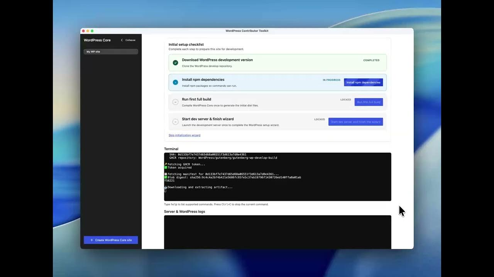
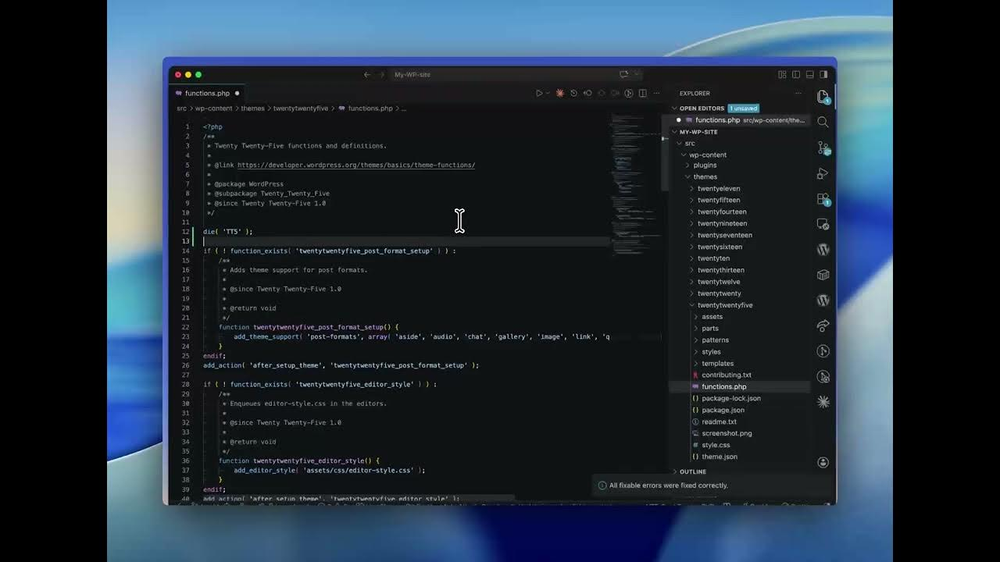

## WordPress Contributor Toolkit (Electron)

[](https://github.com/WordPress/experimental-wp-dev-env/actions/workflows/unit-tests.yml)
[](https://github.com/WordPress/experimental-wp-dev-env/releases/latest)
[](https://github.com/WordPress/experimental-wp-dev-env/releases)

The [WordPress Contributor Toolkit](https://make.wordpress.org/core/2026/04/16/wordpress-core-dev-environment-toolkit-a-faster-path-to-your-first-core-contribution/) is a desktop Electron application (macOS on Apple Silicon, Windows, and Linux) that sets up a full WordPress core development environment with zero prerequisites — no Git, Node.js, npm or Docker on the host.

### Why

One of the most common complaints from Contributor Day facilitators is this: participants spend the entire session trying to set up their local environment and never get to actually contribute.

Before writing a single line of code, a first-time WordPress core contributor typically needs to install Git, Node.js, npm, Docker, configure everything correctly, and troubleshoot whatever breaks along the way. At in-person events, this alone can take hours — sometimes the full day.

The **WordPress Core Dev Environment Toolkit** aims to eliminate this friction entirely.

## Documentation

**The user guide lives at <https://wordpress.github.io/contributor-toolkit/>** — installing
the app, creating a site, working on a Trac ticket, applying patches and PRs, and submitting your
changes as a pull request, a Trac attachment, or a patch for a mentor. What follows here is only
what a contributor to *this repository* needs.

Here’s the full setup flow — from a fresh install to a running WordPress development environment:

[](https://www.youtube.com/watch?v=e00PAh8WNOI)

[_Watch Video_](https://www.youtube.com/watch?v=e00PAh8WNOI)

Once your environment is running, generating a patch to submit to Trac takes just a few clicks:

[](https://youtu.be/yodwdm7Z9vo?si=2Wk7Wuc6lTuaSeSf)

[_Watch Video_](https://youtu.be/yodwdm7Z9vo?si=2Wk7Wuc6lTuaSeSf)

## Getting started

### Just using the app

Download the latest packaged build from the
[Releases page](https://github.com/WordPress/contributor-toolkit/releases/latest) and follow
[Getting started](https://wordpress.github.io/contributor-toolkit/guide/getting-started) in
the user guide — it covers picking the right file per platform, the macOS Gatekeeper notes, and
the first-contribution walkthrough.

### Build from source

Requirements: a recent Node.js to build the Electron app itself (runtime for the app is bundled).

```bash
npm install
npm start            # run Electron + renderer in watch mode

# Package installers (no publishing):
npm run dist         # all configured targets
npm run dist:win     # Windows (x64 by default)
npm run dist:win:arm64
```

The renderer is bundled by esbuild into `src/renderer/index.js` and `index.css`. Those are generated files, are not committed, and are rebuilt by `npm install`, `npm start` and every `npm run dist` — so there is no bundling step to remember after changing `src/renderer/index.jsx`. `npm run build:once` still exists if you want to rebuild on its own.

Output goes to `dist/`. On Linux, `npm run dist` creates AppImage, Snap, and DEB packages. macOS packages use the build machine's architecture, and the published macOS builds currently target Apple Silicon (`arm64`) only.

### App icon

This app uses the official WordPress “W mark” as its icon.

- Source SVG: `build/wordpress-wmark.svg`
- Packaged icons: `build/icon.icns` (macOS), `build/icon.png` (Linux), `build/icon.ico` (Windows)

Electron Builder picks these up via `build` configuration in `package.json`.

## Technical notes

How the app works from a user's point of view — the toolchain it bundles, keeping a site up to
date with trunk, what SQLite does and doesn't cover — is documented in the
[user guide](https://wordpress.github.io/contributor-toolkit/), not here.

### Why Electron?

* WordPress core relies on Node.js, npm, and webpack for its build system. Electron is an easy way to install Node.js on all major platforms.
* It's a single, self-contained file. It's easy to distribute and install – it can be distributed on a USB sticks if everything else fails.

### Ideas and future work

- Integrate Playground's XDebug.
- Explore bundling MySQL server with the app.
- Migrate to the PHP Git client in https://github.com/wordpress/php-toolkit.
- Potentially integrate with Studio to benefit from PHP version selector, wp-cli integration and other Studio features.
- An ergonomic way of managing the git repository from the UI (commit, conflicts, pushes etc.) Or would it make sense to just endorse another git client?

### Download stats

Release downloads are the only usage signal this project has, and GitHub keeps no history of
them, so a weekly workflow records the counts to a `metrics` branch. See [STATS.md](STATS.md) for
how to read them and what they do and don't measure.

### Contributing

Much of the work here happens with the support of AI coding agents, and the quality bar is held by
a set of guardrails rather than by trusting the agent. See [CONTRIBUTING.md](CONTRIBUTING.md) for
what runs on every pull request (repo-wide lint, unit tests on macOS and Windows) and the single
review standard to run yourself before opening one — as the `/self-review` skill in Claude Code, or
by following the standard directly on any other agent.

### License

GPLv2 or later. See [LICENSE](LICENSE).

